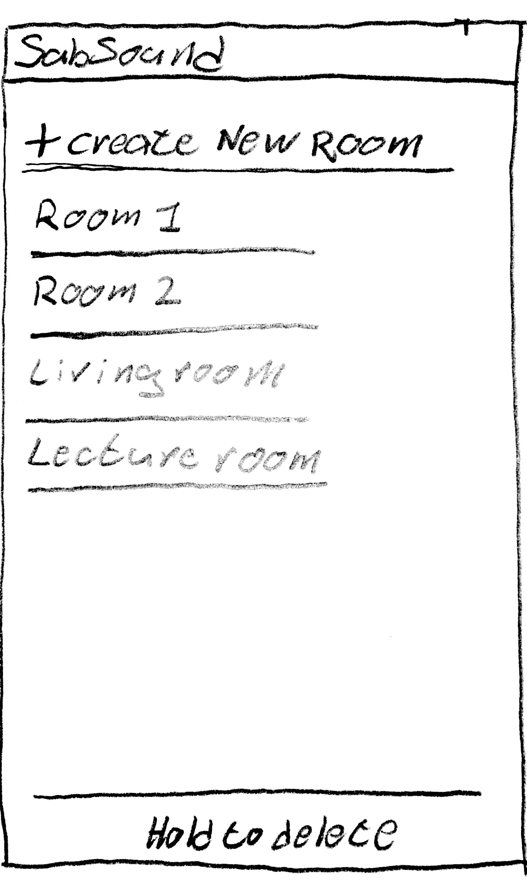
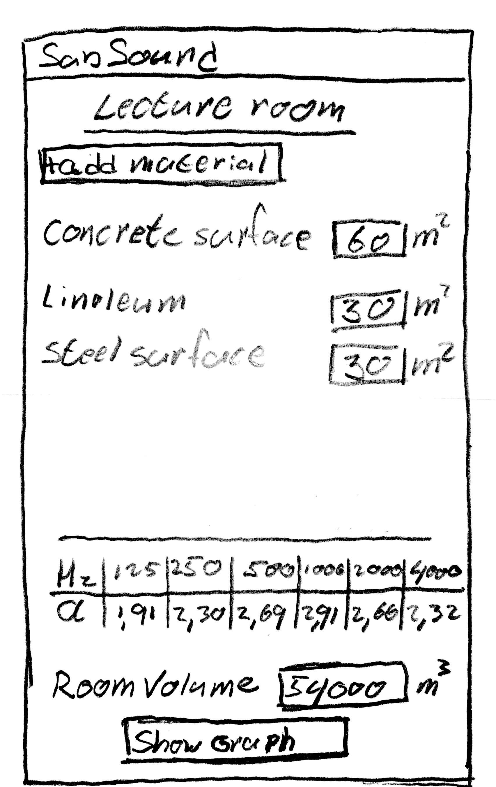
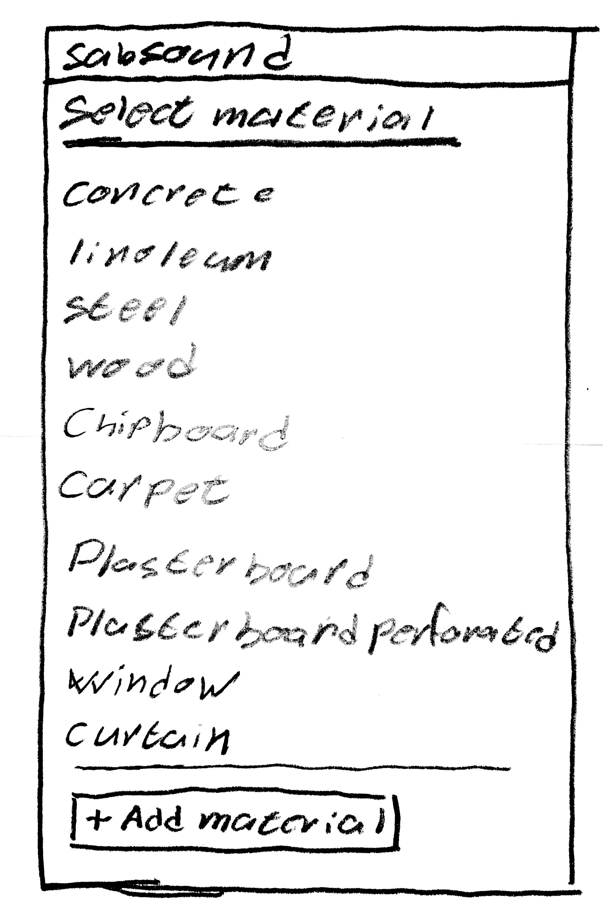
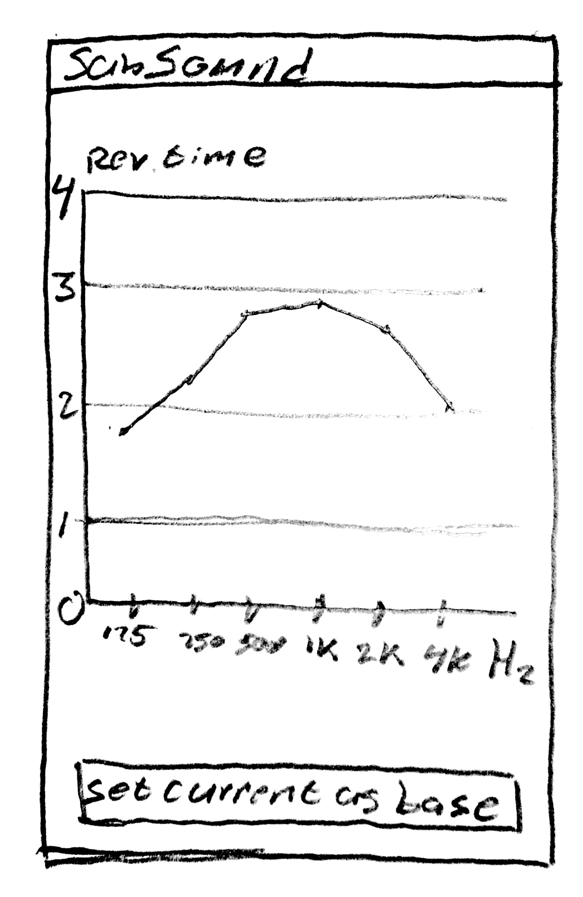

# Eind_Project

SabSound sound reverberation tool
---------------------------------

SabSound will give the user the ability to calculate the reverberation time of a, by the user specified space.
The user will be able to make new "rooms" in the app, add materials and calculate the reverberation time using the Sabine formula.
The app gives the user a library with default materials and their absorption coeffiecients, it will also allow the user to create their own materials with their own defined absorption coefficients.

Using this app, the user can easily calculate the reverberation time of a certain space and improve this by switching materials or changing their dimensions. All wihout the use of diffucult proffesional computer programs, or long handmade calculations.

sketch
------

Data sources
------------
For the material library I will need data on much used building materials and their reverberation times at the necissary frequencies.
This info is widely available and is also listed in one of my engineering handbooks.

This data will be mostlikely put into an xml. file. It should also be possible for the user to add new materials to this file.
Another option would be to store it into object classes in Java.

Application parts
-----------------
The starting screen
- Here the user will be able to choose an excisting room to edit or work on.
- The user will be able to create a new empty room.
- the user will be able to delete a room.

The Room screen
- The user will be able to add new materials to the room.
- The user will be able to define or change the surface area of the materials.
- The user will be able to delete materials.
- current reverbaration times will be displayed.
- the user will be able to navigate to the graph screen showing the current reverberations.
- save the current room.

material screen
- The user can choose a material from the labrary to add to the room.
- The user can create his own material.

Graph screen
- This shows the current reverberation times of the activated room in a graph.
- The user will be able set a base, so it can be compared with new changes.
Disclaimer: if problems appear in reaching the deadline, the graph will be the first to go. 
As the displayed reverberation times in the room screen will be enough to get a good result.

API's
-----
- Graph API, an external API that imports the ability to show a simply line- graph will most likely be needed.

Potential problems
-------------------
A potential problem could appear in the importation of the material library and giving the user the ability to add new data into this.
Each material has a name and six different frequency absorption values. How to import this and make it editable could become a challange.

Similar apps
------------
At the moment there are no apps available that profide similar functions. There are however some professional programs available for pc. A program like this is Sabin, created by Acoustics Engineering at the technical University of Eindhoven. This program gives the ability to add rooms, materials, show graphs, and also has a default material library. It also gives more advanced functions like taking in acount of humidity, temprature, and air preasure, these however are barely used in fast calculations.
It is a "folder" style structured program, and is hard to operate without the use of a guide, there is a lot displayed in one screen and is in quite overwhelming at first.

In this app I hope to force the user to work sturtured and withoud the use of a guide. It should be a few simple steps, as follow:
create room -> add materials -> view results -> optional: edit room.

